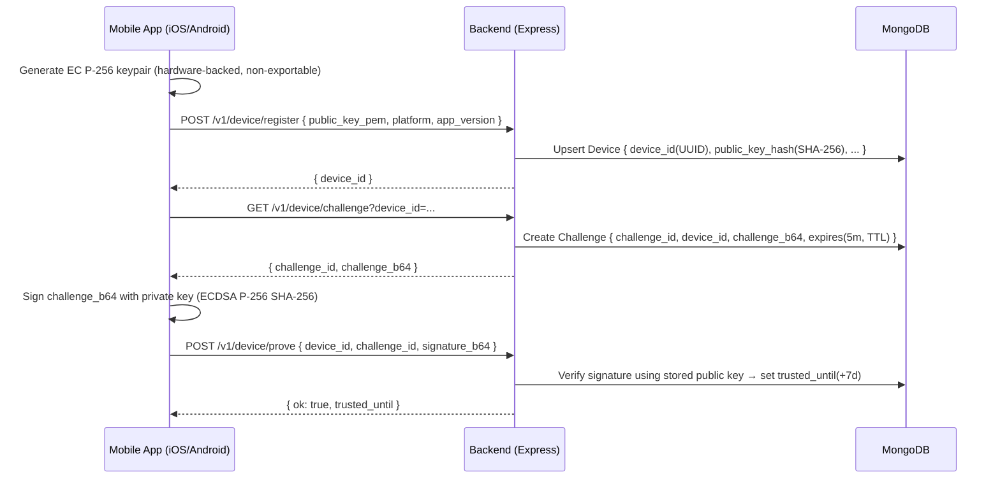

# Secure Device Uniqueness (Ultra‑Pro Guide)
**Node.js + TypeScript + Express + Mongoose, with iOS & Android client flows**  
**Privacy‑safe hardware‑backed device proof without IMEI/MAC/IDFA/AAID**

> This is a production‑grade, must‑read playbook to implement “same device” checks using public‑key cryptography and a challenge–response flow. The private key never leaves the device.

---

## Table of Contents
1. [Why this approach](#why-this-approach)
2. [High‑level architecture](#high-level-architecture)
3. [Security model at a glance](#security-model-at-a-glance)
4. [Quick start checklist](#quick-start-checklist)
5. [Backend: Tech stack & setup](#backend-tech-stack--setup)
6. [Project structure](#project-structure)
7. [Environment & config](#environment--config)
8. [Data model (MongoDB/Mongoose)](#data-model-mongodbmongoose)
9. [Validation, errors, logging, rate limiting](#validation-errors-logging-rate-limiting)
10. [Crypto utilities (verify & hashing)](#crypto-utilities-verify--hashing)
11. [HTTP API (controllers & routes)](#http-api-controllers--routes)
12. [Trust window middleware](#trust-window-middleware)
13. [OpenAPI (Swagger) snippet](#openapi-swagger-snippet)
14. [Testing (Jest + Supertest)](#testing-jest--supertest)
15. [iOS client (Swift) step‑by‑step](#ios-client-swift-step-by-step)
16. [Android client (Kotlin) step‑by‑step](#android-client-kotlin-step-by-step)
17. [Hardening & operations](#hardening--operations)
18. [Runbook & incidents](#runbook--incidents)
19. [FAQ](#faq)
20. [Appendix: Docker & scripts](#appendix-docker--scripts)

---

## Why this approach
- **Store‑compliant & privacy‑safe**: No hardware identifiers (no IMEI/MAC/IDFA/AAID).  
- **Hardware‑backed**: Keys are created in Secure Enclave (iOS) or Android Keystore; **non‑exportable**.  
- **Cloning resistant**: Copying app data does not copy the private key.  
- **Simple to reason about**: Challenge–response with ECDSA P‑256 + SHA‑256.  
- **Revocable & tunable**: Control trust windows; revoke specific devices.

---

## High‑level architecture



---

## Security model at a glance
- **What we prove**: “The same physical device (key) is presenting this request.”  
- **What we don’t prove** (without attestation): Root/jailbreak status, emulator detection, app integrity.  
- **Optional integrity**: Pair with **iOS App Attest / DeviceCheck** and **Android Play Integrity** tokens on sensitive flows.

---

## Quick start checklist
- [ ] Create P‑256 keypair **on device**, private key **non‑exportable**.  
- [ ] Send **public key (PEM/SPKI)** to `/device/register` → get `device_id`.  
- [ ] When needed, call `/device/challenge`, sign `challenge_b64`, then `/device/prove`.  
- [ ] Cache `trusted_until` and avoid re‑challenges until it elapses.  
- [ ] Add **rate limiting**, **revocation**, **logging**, **Zod validation**, **TTL challenges**.

---

## Backend: Tech stack & setup

```bash
npm i express mongoose zod cors helmet express-rate-limit pino-http uuid dotenv
npm i -D typescript ts-node-dev @types/express @types/node @types/cors @types/uuid jest ts-jest @types/jest supertest @types/supertest
npx tsc --init
```

**package.json**
```json
{
  "type": "module",
  "scripts": {
    "dev": "ts-node-dev --respawn --transpile-only src/server.ts",
    "build": "tsc",
    "start": "node dist/server.js",
    "test": "jest --runInBand"
  }
}
```

> **Note**: We use ESM (`\"type\": \"module\"`). Import syntax below assumes Node 18+.

---

## Project structure
```
.
├─ src
│  ├─ app.ts
│  ├─ server.ts
│  ├─ config.ts
│  ├─ routes.ts
│  ├─ controllers/
│  │  └─ deviceController.ts
│  ├─ middleware/
│  │  ├─ errorHandler.ts
│  │  ├─ rateLimit.ts
│  │  ├─ zodValidate.ts
│  │  └─ trust.ts
│  ├─ models/
│  │  ├─ Device.ts
│  │  └─ Challenge.ts
│  ├─ utils/
│  │  ├─ crypto.ts
│  │  └─ logger.ts
│  ├─ validation/
│  │  └─ schemas.ts
│  └─ openapi/
│     └─ openapi.yaml
├─ .env
├─ tsconfig.json
└─ jest.config.js
```

---

## Environment & config

**.env**
```
MONGO_URI=mongodb://localhost:27017/device_uniqueness
PORT=3000
TRUST_WINDOW_DAYS=7
CHALLENGE_TTL_MINUTES=5
RATE_LIMIT_WINDOW_MS=60000
RATE_LIMIT_MAX=60
```

**src/config.ts**
```ts
import 'dotenv/config';

export const config = {
  mongoUri: process.env.MONGO_URI || 'mongodb://localhost:27017/device_uniqueness',
  port: Number(process.env.PORT || 3000),
  trustWindowMs: Number(process.env.TRUST_WINDOW_DAYS || 7) * 24 * 3600 * 1000,
  challengeTtlMs: Number(process.env.CHALLENGE_TTL_MINUTES || 5) * 60 * 1000,
  rateLimitWindowMs: Number(process.env.RATE_LIMIT_WINDOW_MS || 60_000),
  rateLimitMax: Number(process.env.RATE_LIMIT_MAX || 60),
};
```

---

## Data model (MongoDB/Mongoose)

**src/models/Device.ts**
```ts
import { Schema, model } from 'mongoose';

const DeviceSchema = new Schema({
  deviceId: { type: String, unique: true, index: true },  // UUID
  publicKeyPem: { type: String, required: true },
  publicKeyHash: { type: String, required: true, unique: true, index: true }, // SHA-256(SPKI DER)
  platform: { type: String, enum: ['ios', 'android'], required: true, index: true },
  appVersion: { type: String },
  trustedUntil: { type: Date, index: true },
  revoked: { type: Boolean, default: false, index: true }
}, { timestamps: true });

export const Device = model('Device', DeviceSchema);
```

**Why `publicKeyHash`?**  
Avoid duplicate registrations for the same key. If the same device reinstalls, you can return the same `device_id`.

**src/models/Challenge.ts**
```ts
import { Schema, model } from 'mongoose';

const ChallengeSchema = new Schema({
  challengeId: { type: String, unique: true, index: true },
  deviceId: { type: String, index: true, required: true },
  challengeB64: { type: String, required: true },
  expiresAt: { type: Date, index: { expireAfterSeconds: 0 } } // TTL
}, { timestamps: true });

export const Challenge = model('Challenge', ChallengeSchema);
```

> **TTL**: MongoDB TTL monitor purges expired challenges periodically (not instantly).

---

## Validation, errors, logging, rate limiting

**src/validation/schemas.ts**
```ts
import { z } from 'zod';

export const RegisterBody = z.object({
  platform: z.enum(['ios', 'android']),
  public_key_pem: z.string().min(40),
  app_version: z.string().optional(),
});

export const ProveBody = z.object({
  device_id: z.string().uuid(),
  challenge_id: z.string().uuid(),
  signature_b64: z.string().min(16),
});
```

**src/middleware/zodValidate.ts**
```ts
import { AnyZodObject } from 'zod';
import { Request, Response, NextFunction } from 'express';

export const validateBody = (schema: AnyZodObject) =>
  (req: Request, res: Response, next: NextFunction) => {
    const parsed = schema.safeParse(req.body);
    if (!parsed.success) {
      return res.status(400).json({ error: 'bad_request', details: parsed.error.flatten() });
    }
    req.body = parsed.data;
    next();
  };
```

**src/middleware/errorHandler.ts**
```ts
import { Request, Response, NextFunction } from 'express';

export function errorHandler(err: any, _req: Request, res: Response, _next: NextFunction) {
  // Avoid leaking internals
  const status = err?.status || 500;
  const code = err?.code || 'internal_error';
  res.status(status).json({ error: code });
}
```

**src/middleware/rateLimit.ts**
```ts
import rateLimit from 'express-rate-limit';
import { config } from '../config';

export const apiLimiter = rateLimit({
  windowMs: config.rateLimitWindowMs,
  max: config.rateLimitMax,
  standardHeaders: true,
  legacyHeaders: false,
});
```

**src/utils/logger.ts**
```ts
import pinoHttp from 'pino-http';

export const logger = pinoHttp({
  autoLogging: true,
  transport: process.env.NODE_ENV === 'production' ? undefined : { target: 'pino-pretty' }
});
```

---

## Crypto utilities (verify & hashing)

**src/utils/crypto.ts**
```ts
import crypto from 'crypto';

/** Convert PEM public key (SPKI) -> DER Buffer */
export function pemToDer(pem: string): Buffer {
  const lines = pem.trim().split(/\r?\n/).filter(l => !l.includes('-----'));
  const b64 = lines.join('');
  return Buffer.from(b64, 'base64');
}

/** SHA-256 of DER bytes -> hex */
export function sha256Hex(buf: Buffer): string {
  return crypto.createHash('sha256').update(buf).digest('hex');
}

/** Verify ECDSA P-256 SHA-256 over raw challenge bytes */
export function verifySignature(publicKeyPem: string, challengeB64: string, signatureB64: string): boolean {
  const verifier = crypto.createVerify('SHA256');
  verifier.update(Buffer.from(challengeB64, 'base64'));
  verifier.end();
  return verifier.verify(publicKeyPem, Buffer.from(signatureB64, 'base64'));
}
```

---

## HTTP API (controllers & routes)

**src/controllers/deviceController.ts**
```ts
import { Request, Response } from 'express';
import { v4 as uuidv4 } from 'uuid';
import crypto from 'crypto';
import { Device } from '../models/Device';
import { Challenge } from '../models/Challenge';
import { config } from '../config';
import { pemToDer, sha256Hex, verifySignature } from '../utils/crypto';

export async function register(req: Request, res: Response) {
  const { platform, public_key_pem, app_version } = req.body;

  // Normalize & hash public key (DER of SPKI)
  const der = pemToDer(public_key_pem);
  const publicKeyHash = sha256Hex(der);

  // Upsert by publicKeyHash so reinstalls map to same deviceId
  const existing = await Device.findOne({ publicKeyHash });
  if (existing) {
    if (existing.revoked) return res.status(403).json({ error: 'revoked' });
    // Optionally update appVersion/platform
    if (app_version || platform) {
      existing.appVersion = app_version ?? existing.appVersion;
      existing.platform = platform ?? existing.platform;
      await existing.save();
    }
    return res.json({ device_id: existing.deviceId });
  }

  const deviceId = uuidv4();
  await Device.create({
    deviceId,
    publicKeyPem: public_key_pem,
    publicKeyHash,
    platform,
    appVersion: app_version,
    trustedUntil: undefined,
    revoked: false
  });

  return res.json({ device_id: deviceId });
}

export async function challenge(req: Request, res: Response) {
  const deviceId = String(req.query.device_id || '');
  if (!deviceId) return res.status(400).json({ error: 'bad_request' });

  const device = await Device.findOne({ deviceId });
  if (!device) return res.status(404).json({ error: 'not_found' });
  if (device.revoked) return res.status(403).json({ error: 'revoked' });

  const challengeId = uuidv4();
  const challengeB64 = crypto.randomBytes(32).toString('base64');
  const expiresAt = new Date(Date.now() + config.challengeTtlMs);

  await Challenge.create({ challengeId, deviceId, challengeB64, expiresAt });
  return res.json({ challenge_id: challengeId, challenge_b64: challengeB64, expires_at: expiresAt.toISOString() });
}

export async function prove(req: Request, res: Response) {
  const { device_id, challenge_id, signature_b64 } = req.body;

  const ch = await Challenge.findOne({ challengeId: challenge_id, deviceId: device_id });
  if (!ch) return res.status(400).json({ error: 'invalid_challenge' });
  if (ch.expiresAt.getTime() < Date.now()) return res.status(400).json({ error: 'expired' });

  const device = await Device.findOne({ deviceId: device_id });
  if (!device) return res.status(404).json({ error: 'device_not_found' });
  if (device.revoked) return res.status(403).json({ error: 'revoked' });

  const ok = verifySignature(device.publicKeyPem, ch.challengeB64, signature_b64);
  if (!ok) return res.status(401).json({ error: 'bad_signature' });

  device.trustedUntil = new Date(Date.now() + config.trustWindowMs);
  await device.save();
  await ch.deleteOne(); // one-time use

  return res.json({ ok: true, trusted_until: device.trustedUntil.toISOString() });
}

export async function revoke(req: Request, res: Response) {
  const { device_id } = req.body || {};
  const device = await Device.findOne({ deviceId: device_id });
  if (!device) return res.status(404).json({ error: 'device_not_found' });
  device.revoked = true;
  await device.save();
  return res.json({ ok: true });
}

/** Optional: key rotation — add new key and phase out old */
export async function rotateKey(req: Request, res: Response) {
  const { device_id, new_public_key_pem } = req.body || {};
  const device = await Device.findOne({ deviceId: device_id });
  if (!device) return res.status(404).json({ error: 'device_not_found' });
  const der = pemToDer(new_public_key_pem);
  const newHash = sha256Hex(der);

  // Prevent collision with another device
  const conflict = await Device.findOne({ publicKeyHash: newHash });
  if (conflict && conflict.deviceId !== device_id) {
    return res.status(409).json({ error: 'key_in_use' });
  }

  device.publicKeyPem = new_public_key_pem;
  device.publicKeyHash = newHash;
  await device.save();

  return res.json({ ok: true });
}
```

**src/routes.ts**
```ts
import { Router } from 'express';
import { register, challenge, prove, revoke, rotateKey } from './controllers/deviceController';
import { validateBody } from './middleware/zodValidate';
import { RegisterBody, ProveBody } from './validation/schemas';

export const router = Router();

router.post('/v1/device/register', validateBody(RegisterBody), register);
router.get('/v1/device/challenge', challenge);
router.post('/v1/device/prove', validateBody(ProveBody), prove);

// Admin/Support ops (protect behind auth in real systems)
router.post('/v1/device/revoke', revoke);
router.post('/v1/device/rotate', rotateKey);
```

**src/app.ts**
```ts
import express from 'express';
import cors from 'cors';
import helmet from 'helmet';
import { router } from './routes';
import { apiLimiter } from './middleware/rateLimit';
import { errorHandler } from './middleware/errorHandler';
import { logger } from './utils/logger';

const app = express();
app.use(logger);
app.use(helmet());
app.use(cors({ origin: true, credentials: true }));
app.use(express.json({ limit: '256kb' }));
app.use(apiLimiter);

app.use(router);
app.use(errorHandler);

export default app;
```

**src/server.ts**
```ts
import mongoose from 'mongoose';
import { config } from './config';
import app from './app';

(async () => {
  await mongoose.connect(config.mongoUri);
  app.listen(config.port, () => {
    // eslint-disable-next-line no-console
    console.log(`API listening on :${config.port}`);
  });
})();
```

**jest.config.js**
```js
module.exports = {
  preset: 'ts-jest',
  testEnvironment: 'node',
  roots: ['<rootDir>/src/tests'],
};
```

---

## Trust window middleware

Use this when gating sensitive endpoints; if the trust window expired, the client must re‑prove.

**src/middleware/trust.ts**
```ts
import { Request, Response, NextFunction } from 'express';
import { Device } from '../models/Device';

export async function requireTrustedDevice(req: Request, res: Response, next: NextFunction) {
  const deviceId = String(req.headers['x-device-id'] || '');
  if (!deviceId) return res.status(401).json({ error: 'device_id_required' });

  const device = await Device.findOne({ deviceId });
  if (!device) return res.status(404).json({ error: 'device_not_found' });
  if (device.revoked) return res.status(403).json({ error: 'revoked' });

  const now = Date.now();
  if (!device.trustedUntil || device.trustedUntil.getTime() < now) {
    return res.status(428).json({ error: 'proof_required' });
  }

  next();
}
```

---

## OpenAPI (Swagger) snippet

**src/openapi/openapi.yaml**
```yaml
openapi: 3.0.3
info:
  title: Device Uniqueness API
  version: 1.0.0
paths:
  /v1/device/register:
    post:
      summary: Register device public key -> device_id
      requestBody:
        required: true
        content:
          application/json:
            schema:
              type: object
              required: [platform, public_key_pem]
              properties:
                platform:
                  type: string
                  enum: [ios, android]
                public_key_pem:
                  type: string
                app_version:
                  type: string
      responses:
        '200':
          description: OK
  /v1/device/challenge:
    get:
      parameters:
        - in: query
          name: device_id
          required: true
          schema: { type: string, format: uuid }
      responses:
        '200': { description: OK }
  /v1/device/prove:
    post:
      requestBody:
        required: true
        content:
          application/json:
            schema:
              type: object
              required: [device_id, challenge_id, signature_b64]
              properties:
                device_id: { type: string, format: uuid }
                challenge_id: { type: string, format: uuid }
                signature_b64: { type: string }
      responses:
        '200': { description: OK }
```

---

## Testing (Jest + Supertest)

**src/tests/device.e2e.test.ts**
```ts
import request from 'supertest';
import mongoose from 'mongoose';
import crypto from 'crypto';
import app from '../app';
import { config } from '../config';

describe('Device uniqueness flow', () => {
  let server: any;
  let base: request.SuperTest<request.Test>;

  beforeAll(async () => {
    await mongoose.connect(config.mongoUri);
    server = app.listen(0);
    base = request(server);
  });

  afterAll(async () => {
    await mongoose.disconnect();
    server.close();
  });

  test('register -> challenge -> prove', async () => {
    // Generate ephemeral P-256 keypair for test
    const { publicKey, privateKey } = crypto.generateKeyPairSync('ec', { namedCurve: 'prime256v1' });
    const publicKeyPem = publicKey.export({ type: 'spki', format: 'pem' }).toString();

    // 1) register
    const reg = await base.post('/v1/device/register').send({ platform: 'ios', public_key_pem: publicKeyPem, app_version: '1.0.0' }).expect(200);
    const deviceId = reg.body.device_id;

    // 2) challenge
    const ch = await base.get('/v1/device/challenge').query({ device_id: deviceId }).expect(200);
    const { challenge_id, challenge_b64 } = ch.body;

    // 3) sign challenge
    const sign = crypto.createSign('SHA256');
    sign.update(Buffer.from(challenge_b64, 'base64'));
    sign.end();
    const signature = sign.sign(privateKey).toString('base64');

    // 4) prove
    const pv = await base.post('/v1/device/prove').send({ device_id: deviceId, challenge_id, signature_b64: signature }).expect(200);
    expect(pv.body.ok).toBe(true);
    expect(pv.body.trusted_until).toBeTruthy();
  });
});
```

---

## iOS client (Swift) step‑by‑step

> **Goal**: Create EC P‑256 keypair in Secure Enclave (fallback on simulator), export **public key (PEM)**, register, then sign challenges.

**Key utilities**
```swift
import Foundation
import Security

enum DeviceCrypto {
    static let keyTag = "com.yourapp.devicekey".data(using: .utf8)!

    static func loadOrCreatePrivateKey() throws -> SecKey {
        // Try to load
        let query: [String: Any] = [
            kSecClass as String: kSecClassKey,
            kSecAttrApplicationTag as String: keyTag,
            kSecAttrKeyType as String: kSecAttrKeyTypeECSECPrimeRandom,
            kSecReturnRef as String: true
        ]
        var item: CFTypeRef?
        let status = SecItemCopyMatching(query as CFDictionary, &item)
        if status == errSecSuccess, let key = (item as! SecKey?) { return key }

        // Create (prefer Secure Enclave on device)
        #if targetEnvironment(simulator)
        let ac = SecAccessControlCreateWithFlags(nil, kSecAttrAccessibleAfterFirstUnlock, [], nil)!
        let attrs: [String: Any] = [
            kSecAttrKeyType as String: kSecAttrKeyTypeECSECPrimeRandom,
            kSecAttrKeySizeInBits as String: 256,
            kSecPrivateKeyAttrs as String: [
                kSecAttrIsPermanent as String: true,
                kSecAttrApplicationTag as String: keyTag,
                kSecAttrAccessControl as String: ac
            ]
        ]
        #else
        let ac = SecAccessControlCreateWithFlags(nil, kSecAttrAccessibleAfterFirstUnlockThisDeviceOnly, .privateKeyUsage, nil)!
        let attrs: [String: Any] = [
            kSecAttrTokenID as String: kSecAttrTokenIDSecureEnclave,
            kSecAttrKeyType as String: kSecAttrKeyTypeECSECPrimeRandom,
            kSecAttrKeySizeInBits as String: 256,
            kSecPrivateKeyAttrs as String: [
                kSecAttrIsPermanent as String: true,
                kSecAttrApplicationTag as String: keyTag,
                kSecAttrAccessControl as String: ac
            ]
        ]
        #endif

        var err: Unmanaged<CFError>?
        guard let priv = SecKeyCreateRandomKey(attrs as CFDictionary, &err) else {
            throw err!.takeRetainedValue() as Error
        }
        return priv
    }

    static func publicKeyPEM(from privateKey: SecKey) throws -> String {
        guard let pub = SecKeyCopyPublicKey(privateKey) else { throw NSError() }
        var error: Unmanaged<CFError>?
        guard let rawPoint = SecKeyCopyExternalRepresentation(pub, &error) as Data? else {
            throw error!.takeRetainedValue() as Error
        }
        let spki = try wrapX963ToSPKI_P256(rawPoint: rawPoint)
        let b64 = spki.base64EncodedString(options: [.lineLength64Characters, .endLineWithLineFeed])
        return "-----BEGIN PUBLIC KEY-----\n\(b64)\n-----END PUBLIC KEY-----"
    }

    private static func wrapX963ToSPKI_P256(rawPoint: Data) throws -> Data {
        let header = Data([
            0x30,0x59,
            0x30,0x13,
            0x06,0x07,0x2A,0x86,0x48,0xCE,0x3D,0x02,0x01,
            0x06,0x08,0x2A,0x86,0x48,0xCE,0x3D,0x03,0x01,0x07,
            0x03,0x42,0x00
        ])
        return header + rawPoint
    }

    static func sign(challengeB64: String) throws -> String {
        let data = Data(base64Encoded: challengeB64)!
        var error: Unmanaged<CFError>?
        let priv = try loadOrCreatePrivateKey()
        guard let sig = SecKeyCreateSignature(priv, .ecdsaSignatureMessageX962SHA256, data as CFData, &error) as Data? else {
            throw error!.takeRetainedValue() as Error
        }
        return sig.base64EncodedString()
    }
}
```

**Flow**
1. On first launch (or missing `device_id`), generate key & **register**:
   - `let priv = try DeviceCrypto.loadOrCreatePrivateKey()`
   - `let pem = try DeviceCrypto.publicKeyPEM(from: priv)`
   - `POST /v1/device/register` with `{ platform: "ios", public_key_pem: pem, app_version }`
   - Save `device_id` to **Keychain** (kSecClassGenericPassword).
2. When `proof_required` or trust window expired:
   - `GET /v1/device/challenge?device_id=...`
   - `let sigB64 = try DeviceCrypto.sign(challenge_b64)`
   - `POST /v1/device/prove` with `{ device_id, challenge_id, signature_b64 }`
   - Cache `trusted_until` (e.g., in Keychain or NSUserDefaults).
3. Optional integrity:
   - Add **App Attest** or **DeviceCheck** token to the same request and verify server‑side.

---

## Android client (Kotlin) step‑by‑step

**Utilities**
```kotlin
import android.security.keystore.KeyGenParameterSpec
import android.security.keystore.KeyProperties
import java.security.KeyPairGenerator
import java.security.KeyStore
import java.security.Signature
import java.security.spec.ECGenParameterSpec
import java.util.Base64

object DeviceCrypto {
    private const val ANDROID_KEYSTORE = "AndroidKeyStore"
    private const val KEY_ALIAS = "com.yourapp.devicekey"

    fun ensureKeyPair() {
        val ks = KeyStore.getInstance(ANDROID_KEYSTORE).apply { load(null) }
        if (ks.containsAlias(KEY_ALIAS)) return

        val spec = KeyGenParameterSpec.Builder(
            KEY_ALIAS,
            KeyProperties.PURPOSE_SIGN or KeyProperties.PURPOSE_VERIFY
        ).setAlgorithmParameterSpec(ECGenParameterSpec("secp256r1"))
         .setDigests(KeyProperties.DIGEST_SHA256)
         .setUserAuthenticationRequired(false)
         .setKeySize(256)
         .build()

        val kpg = KeyPairGenerator.getInstance(KeyProperties.KEY_ALGORITHM_EC, ANDROID_KEYSTORE)
        kpg.initialize(spec)
        kpg.generateKeyPair()
    }

    fun publicKeyPem(): String {
        val ks = KeyStore.getInstance(ANDROID_KEYSTORE).apply { load(null) }
        val cert = ks.getCertificate(KEY_ALIAS)
        val spki = cert.publicKey.encoded // DER (X.509 SPKI)
        val b64 = Base64.getMimeEncoder(64, "\n".toByteArray()).encodeToString(spki)
        return "-----BEGIN PUBLIC KEY-----\n$b64\n-----END PUBLIC KEY-----"
    }

    fun signBase64(challengeB64: String): String {
        val ks = KeyStore.getInstance(ANDROID_KEYSTORE).apply { load(null) }
        val entry = ks.getEntry(KEY_ALIAS, null) as KeyStore.PrivateKeyEntry
        val s = Signature.getInstance("SHA256withECDSA")
        s.initSign(entry.privateKey)
        s.update(Base64.getDecoder().decode(challengeB64))
        return Base64.getEncoder().encodeToString(s.sign()) // DER-encoded
    }
}
```

**Flow**
1. On first launch:
   - `DeviceCrypto.ensureKeyPair()`
   - `val pem = DeviceCrypto.publicKeyPem()`
   - `POST /v1/device/register` with `{ platform: "android", public_key_pem: pem, app_version }`
   - Save `device_id` in **EncryptedSharedPreferences**.
2. When `proof_required` or trust window expired:
   - GET challenge
   - Sign challenge → POST prove
   - Cache `trusted_until`.
3. Optional integrity:
   - Add **Play Integrity** verdict to sensitive flows and verify server‑side.

---

## Hardening & operations

**Security hardening**
- Enforce **TLS**; consider **certificate pinning** in mobile.
- **Rate limit** `/register`, `/prove`.
- Store & check **`revoked`** devices.
- **Public key rotation** endpoint with collision checks.
- **Audit log**: success/failure proofs with timestamp & IP.
- **Short TTL** challenges (e.g., 5 min) and **one‑time** usage.
- Optionally store **publicKeyHash** only (plus PEM) and keep PEM encrypted at rest.

**Observability**
- Add structured logs (pino).
- Add metrics (Prometheus/OpenTelemetry) and alerts for spike in `bad_signature`/`invalid_challenge`.

**Scaling**
- Challenges are ephemeral; Mongo TTL is fine. For high scale, consider Redis with TTL for challenges.

**Backups**
- Device collection is small; back up regularly. Challenge collection can be excluded (ephemeral).

---

## Runbook & incidents

- **Signature verification failures**:
  - Ensure EC **P‑256** + **SHA‑256** on both ends.
  - iOS/Android signatures are **DER‑encoded**; Node `crypto.verify` expects that.
  - Public key must be **SPKI PEM**.
- **Duplicate registrations**:
  - We dedupe by `publicKeyHash`. If seen, return existing `device_id`.
- **Trust window abuse**:
  - Use shorter windows for high‑risk actions. Enforce re‑prove on anomaly (IP/geo change).
- **Revocation**:
  - Set `revoked = true`; subsequent actions require remediation or new key.

---

## FAQ

**Q: Can an attacker clone the app and reuse `device_id`?**  
A: Without the private key, they cannot produce valid signatures.

**Q: What if device storage is wiped?**  
A: The keypair persists in Secure Enclave/Keystore if not deleted; if deleted, a new registration produces a new `device_id` (unless you map on user login).

**Q: Is this device fingerprinting?**  
A: No. It’s an explicit, user‑scoped key registration — privacy‑safe and store‑compliant.

---

## Appendix: Docker & scripts

**docker-compose.yml** (MongoDB only)
```yaml
version: '3.9'
services:
  mongo:
    image: mongo:7
    ports: [ "27017:27017" ]
    volumes:
      - ./data/mongo:/data/db
```

**Start**
```bash
docker compose up -d
npm run dev
```

**cURL examples**
```bash
# Register
curl -X POST http://localhost:3000/v1/device/register \
  -H "Content-Type: application/json" \
  -d '{"platform":"ios","public_key_pem":"-----BEGIN PUBLIC KEY-----\n...\n-----END PUBLIC KEY-----","app_version":"1.0.0"}'

# Challenge
curl "http://localhost:3000/v1/device/challenge?device_id=<UUID>"

# Prove
curl -X POST http://localhost:3000/v1/device/prove \
  -H "Content-Type: application/json" \
  -d '{"device_id":"<UUID>","challenge_id":"<UUID>","signature_b64":"<DER-BASE64>"}'
```

---

### You’re ready to ship
Implement the three endpoints, wire the client flows, and you have a robust, privacy‑preserving device uniqueness foundation. Pair with store‑approved attestation for maximum integrity on high‑risk actions.
